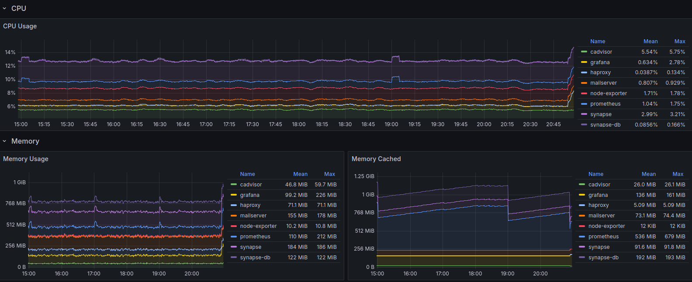

[](https://github.com/ironashram/commstack/actions/workflows/ansible-certbot.yaml)
[](https://github.com/ironashram/commstack/actions/workflows/ansible-matrix.yaml)
[](https://github.com/ironashram/commstack/actions/workflows/ansible-mailserver.yaml)
[](https://github.com/ironashram/commstack/actions/workflows/ansible-monitoring.yaml)
[](https://github.com/ironashram/commstack/actions/workflows/ansible-iptables.yaml)
[](https://github.com/ironashram/commstack/actions/workflows/ansible-packages.yaml)
[](https://github.com/ironashram/commstack/actions/workflows/ansible-full.yaml)


# CommStack

<p align="left">
  
</p>

This repo contains automation and tooling to manage my own mail/matrix server. <br>
Automated SSL generation/renewal is included with Let'sencrypt CA via cerbot and Hetzner DNS challenge.


## Secrets

All secrets are stored in a private Hashicorp Vault instance and fetched with ansible lookups at runtime. <br>
The ansible inventory itself is generated at runtime using the `add_host` trick. <br>
This keeps the code clean, also allows me to make this repo public without security concerns. <br>
Vault Authetication must be set via ENV variables before running the playbook, either by using a token or approle.


## Ansible

Single Tag
```
ansible-playbook -i inventory.yml configure.yml --tags matrix
```

Configure Everything
```
ansible-playbook -i inventory.yml configure.yml
```


## Credits

https://www.ansible.com/ <br>
https://www.vaultproject.io/ <br>
https://github.com/element-hq/synapse <br>
https://github.com/docker-mailserver/docker-mailserver
